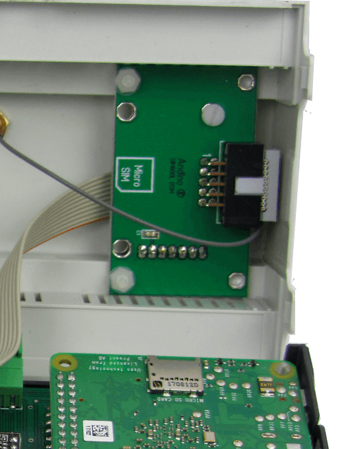

SimCom SIM800L: Setup (2G/EDGE Modem)
======

### Hardware Installation

*Important: Before installation, remove the pin code from the SIM card (e.g. using a Smartphone)!*

Open the Housing and insert the Micro SIM.

The Modem is connected to the internal UART of the Raspberry Pi.  
The Reset Line of the Modem is connected to GPIO 17.

### Useful scripts
For downloads see files in the scripts folder above.

    init.sh   	initialize the Ports to reset Modem
    stop.sh   	Stop (hold in reset) the Modem
    start.sh  	Start the Modem (release reset)
    restart.sh	Stop and Start again
    
    dial.sh   	Init the DialIn
    hangup.sh 	Shutdown PPP
    
    log.sh		Tail the log

### Preparing Debian
First, run

    sudo nano /boot/cmdline.txt

To ensure correct shell behavior, remove entries beginning with *console=* in this file. An example for entries needing to be removed is highlighted here with *>>[entry]<<*. After having edited the file, save with Ctrl+O and exit with Ctrl+X.

    dwc_otg.lpm_enable=0   >>console=serial0,115200 console=tty1<<   root=/dev/mmcblk0

Afterwards, run

    sudo nano /boot/config.txt

Jump to the end of the file and add

    enable_uart=1
    dtoverlay=pi3-disable-bt-overlay
    dtoverlay=pi3-miniuart-bt

Finish by rebooting the pi
    
    sudo reboot
    
### Configuring the modem

First, install some tools for testing
    
    sudo apt-get install screen elinks minicom

Testing the modem connection can be done via minicom. For the initial setup, run
    
    sudo minicom --setup

After having completed the initial setup, minicom can be run without the --setup flag in the future. Enter Serial port setup

	+-----[configuration]------+
    | Filenames and paths      |
    | File transfer protocols  |
    | Serial port setup        |
    | Modem and dialing        |
    | Screen and keyboard      |
    | Save setup as dfl        |
    | Save setup as..          |
    | Exit                     |
    | Exit from Minicom        |
    +--------------------------+

Here the modem connection can be set up. To connect to the 2G modem, the serial device has to be set to */dev/ttySC1*.

    +-----------------------------------+
    | A -Serial Device  : /dev/ttySC1   |
    | B - Lockfile Location : /var/lock |
    | C -   Callin Program  :           |
    | D -  Callout Program  :           |
    | E -Bps/Par/Bits   : 38400 8N1     |
    | F - Hardware Flow Control : No    |
    | G - Software Flow Control : No    |
    |                                   |
    |Change which setting?              |
    +-----------------------------------+

After completing the configuration, press the Esc key to return to the main setup menu, choose *Save setup as dfl* to save the configuration for future usage and exit.

### Testing the modem

To check the connection to the modem, first run *at*. Running *ati* will show the version of the modem.
    
    at
    OK
    ati
    SIM800 R14.18
    OK

For debugging purposes, Errors can be set to be shown as text. This can be accomplished by running *at+cmee=2*.

    # Show Error as text
    AT+CMEE=2

The network connectivity can also be tested, making sure that the SIM works correctly and the modem has good reception.

    # SIM Ready?
    AT+CPIN?
    +CPIN: READY
    # Network available?
    AT+COPS?
    +COPS: 0,0,"D1"
    # Network quality?
    AT+CSQ
    +CSQ: 4,0

After having confirmed that the modem has established a connection, minicom can be closed by pressing *Ctrl+a*, followed by the *x* key. The modem can be used for sending and receiving messages or connecting to the internet using ppp. For the next steps refer to the links below.

### Further documentation

- [SimCom SIM800L: Sending and receiving SMS](./sms)
- [SimCom SIM800L: Setting up ppp and establishing an internet connection](./ppp)

