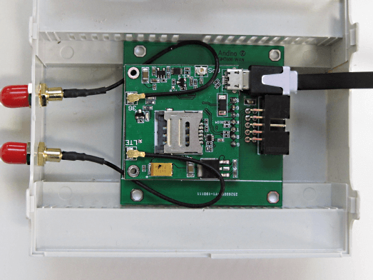

SIM7600E: Setup via ppp (4G/LTE Modem)
======

**For the SimCom 7600 setup via PPP is working but not recommended because it is a high bandwidth module. For a qmi install (recommended), please refer to [SimCom SIM7600E: Setting up via QMI](../qmi/)**

*Important: Before installation, remove the pin code from the SIM card (e.g. using a smartphone)!*

Open the Housing and insert the Micro SIM

The Modem is connected to the internal UART of the Raspberry Pi.  
The Reset Line of the Modem is connected to GPIO 17.

### Useful scripts
For downloads see files at the top.

    ./init.sh   	initialize the Ports to reset Modem
    ./stop.sh   	Stop (hold in reset) the Modem
    ./start.sh  	Start the Modem (release reset)
    ./restart.sh	Stop and Start again
    
    ./dial.sh   	Init the DialIn
    ./hangup.sh 	Shutdown PPP
    
    ./log.sh		Tail the log

### Preparing Debian
First, run
    sudo nano /boot/cmdline.txt
To ensure correct shell behavior, remove entries beginning with *console=* in this file. An example for entries needing to be removed is highlighted here with *>>[entry]<<*. After having edited the file, save with Ctrl+O and exit with Ctrl+X.

    dwc_otg.lpm_enable=0   >>console=serial0,115200 console=tty1<<   root=/dev/mmcblk0

Afterwards, run

    sudo nano /boot/config.txt

Jump to the end of the file and add

    enable_uart=1
    dtoverlay=pi3-disable-bt-overlay
    dtoverlay=pi3-miniuart-bt

Finish by rebooting the pi
    
    sudo reboot
    
### Configuring the modem

First, install some tools for testing
    
    sudo apt-get install screen elinks minicom

Testing the modem connection can be done via minicom. For the initial setup, run
    
    sudo minicom --setup

After having completed the initial setup, minicom can be run without the --setup flag in the future. Enter Serial port setup

	+-----[configuration]------+
    | Filenames and paths      |
    | File transfer protocols  |
    | Serial port setup        |
    | Modem and dialing        |
    | Screen and keyboard      |
    | Save setup as dfl        |
    | Save setup as..          |
    | Exit                     |
    | Exit from Minicom        |
    +--------------------------+

Here the modem connection can be set up. To connect to the 4G modem, the serial device has to be set to */dev/ttyUSB2*.

    +-----------------------------------+
    | A -Serial Device  : /dev/ttyUSB2  |
    | B - Lockfile Location : /var/lock |
    | C -   Callin Program  :           |
    | D -  Callout Program  :           |
    | E -Bps/Par/Bits   : 115200 8N1    |
    | F - Hardware Flow Control : No    |
    | G - Software Flow Control : No    |
    |                                   |
    |Change which setting?              |
    +-----------------------------------+

After completing the configuration, press the Esc key to return to the main setup menu, choose *Save setup as dfl* to save the configuration for future usage and exit.

### Testing the modem

To check the connection to the modem, first run *at*. Running *ati* will show the version of the modem.
    
    at
    OK
    ati
    SIM7600 R14.18
    OK

For debugging purposes, Errors can be set to be shown as text. This can be accomplished by running *at+cmee=2*.

    # Show Error as text
    AT+CMEE=2

The network connectivity can also be tested, making sure that the SIM works correctly and the modem has good reception.

    # SIM Ready?
    AT+CPIN?
    +CPIN: READY
    # Network available?
    AT+COPS?
    +COPS: 0,0,"D1"
    # Network quality?
    AT+CSQ
    +CSQ: 4,0

After having confirmed that the modem has established a connection, minicom can be closed by pressing *Ctrl+a*, followed by the *x* key. The is now configured for use with SMS. For documentation on sending and receiving SMS, see SimCom SIM7600E: Sending and receiving SMS.

### Connecting to the Internet using ppp

If you want to use the modem to connect to the internet using ppp, install ppp before beginning the configuration.

	apt-get install ppp

### Configuring ppp

"internet.telekom" is my APN and *must* be changed to the providers APN

First we need to create a new file for ppp
    
	sudo nano /etc/ppp/peers/rnet

Enter the following as the file's content. Make sure to change *internet.telekom* in line 2 to the APN of your mobile provider.
 
    #imis/internet is the apn for idea connection
    connect "/usr/sbin/chat -v -f /etc/chatscripts/gprs -T internet.telekom"
    
    # For SIM7600E use /dev/ttyUSB2 as the communication port
	# For SIM800 use /dev/ttySC1 as the communication port
    /dev/ttyUSB2
    
    # Baudrate
    115200
    
    # Assumes that your IP address is allocated dynamically by the ISP.
    noipdefault
    
    # Try to get the name server addresses from the ISP.
    usepeerdns
    
    # Use this connection as the default route to the internet.
    defaultroute
    
    # Makes PPPD "dial again" when the connection is lost.
    persist
    
    # Do not ask the remote to authenticate.
    noauth
    
    # No hardware flow control on the serial link with GSM Modem
    nocrtscts
    
    # No modem control lines with GSM Modem
    local

Save the file and exit. Now, edit the file

	sudo nano /etc/chatscripts/gprs

Make sure the content of the file is the following:
    
    # You can use this script unmodified to connect to cellular networks.
    # The APN is specified in the peers file as the argument of the -T command
    # line option of chat(8).
    
    # For details about the AT commands involved please consult the relevant
    # standard: 3GPP TS 27.007 - AT command set for User Equipment (UE).
    # (http://www.3gpp.org/ftp/Specs/html-info/27007.htm)
    
    ABORT   BUSY
    ABORT   VOICE
    ABORT   "NO CARRIER"
    ABORT   "NO DIALTONE"
    ABORT   "NO DIAL TONE"
    ABORT   "NO ANSWER"
    ABORT   "DELAYED"
    ABORT   "ERROR"
    
    # cease if the modem is not attached to the network yet
    ABORT   "+CGATT: 0"
    
    ""  AT
    TIMEOUT 12
    OK  ATH
    OK  ATE1
    
    # +CPIN provides the SIM card PIN
    #OK "AT+CPIN=1234"
    
    # +CFUN may allow to configure the handset to limit operations to
    # GPRS/EDGE/UMTS/etc to save power, but the arguments are not standard
    # except for 1 which means "full functionality".
    #OK AT+CFUN=1
    
    OK  AT+CGDCONT=1,"IP","\T","",0,0
    OK  ATD*99#
    TIMEOUT 22
    CONNECT ""

ppp is now configured.

### Check the connection

First dial by running
    
    sudo pon rnet
    
Check in syslog, if the connection was successful. You should a report of your local and remote ip adress by pppd in the last few lines. You can also check ifconfig to see if the modem connection shows up as an interface.

    tail -n 30 /var/log/syslog
    ifconfig
    
Now add the modem as a default route and try to ping a public IP (e.g. Google DNS)

    sudo route add default dev ppp0
    ping 8.8.8.8
    
If successful, the modem can be disconnected from the internet again

    sudo poff rnet

### Automatically connect modem after boot

First, open the interface configuration file

	sudo nano /etc/network/interfaces

Make sure the file has the following content (usually three lines before *source-directory* have to be added)

    # interfaces(5) file used by ifup(8) and ifdown(8)
    
    # Please note that this file is written to be used with dhcpcd
    # For static IP, consult /etc/dhcpcd.conf and 'man dhcpcd.conf'
    
    # Include files from /etc/network/interfaces.d:
    
    auto rnet
    iface rnet inet ppp
    provider rnet
      
    source-directory /etc/network/interfaces.d

Save and exit. Then open the rc.local file
    
    sudo nano /etc/rc.local

Directly before the last line (containing *exit 0*), add the following

    printf "Restart SIM800L\n"
    sudo echo "21" > /sys/class/gpio/export
    sudo echo "out" > /sys/class/gpio/gpio21/direction
    sudo echo "1" > /sys/class/gpio/gpio21/value
    sudo echo "0" > /sys/class/gpio/gpio21/value
    sudo echo "1" > /sys/class/gpio/gpio21/value

The modem should now automatically establish an internet connection whenever the pi boots.

### Further documentation
- SimCom SIM7600E: Sending and receiving SMS
- SimCom SIM7600E: Setting up qmi
