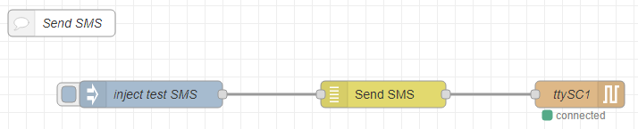
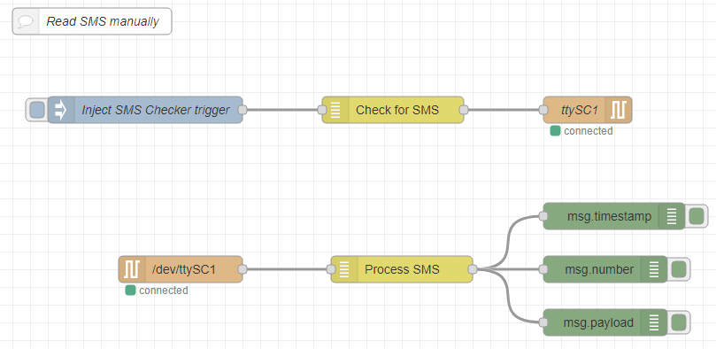
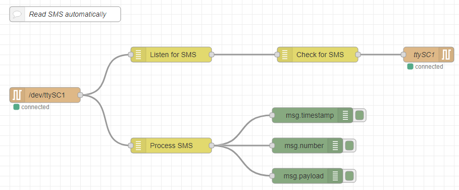

Andino / RaspberryPi: SMS Handling Nodes
====================

A collection of [Node-RED][1] nodes that enable sending and receiving SMS from [Andino](https://github.com/andino-systems/Andino) boards.

Andino boards, like the [Andino X1](https://github.com/andino-systems/Andino/tree/master/Andino-X1), [Andino X2](https://github.com/andino-systems/Andino/tree/master/Andino-X2) and [Andino IO](https://github.com/andino-systems/Andino/tree/master/Andino-IO) enable the usage of the Raspberry Pi in industrial environments by providing a housing, several digital inputs and relay outputs.

**For more information, please refer to:**

* [Our shop page](https://andino.shop/)
* [Our GitHub documentation](https://github.com/andino-systems/Andino)

-------

# Node documentation

This package contains 4 nodes enabling different aspects of SMS handling using the Raspberry Pi and a 2G/4G modem on the Andino. The following sections explain the functionality of each node. The nodes use at commands to communicate with the modem in conjunction with serial nodes.

## SMS Sender

This Node, in conjunction with a serial out node, enables sending SMS to a target phone number. 

*The node requires two input values:*

* **msg.number** (String) - The phone number of the intended recipient. It is recommended, but not always necessary, to include the country code in phone numbers. The number has to be in a dialable format. (eg. +4915123456)
* **msg.payload** (String) - The message that will be sent to the recipient.

The node then sends three output messages (switching the modem to text mode, entering the phone number, entering the message).

## SMS Checker

The SMS Checker node sends out a request reading all unread messages to the modem when receiving an input (the content of the input message is irrelevant). It first sets to modem to text mode, then sends a check SMS command.

## SMS Listener

This node checks all inputs for an indicator message, that a new SMS has arrived (*+CMTI:*). When receiving a matching message, it relays the message to the next node.

The SMS Listener node can be used in conjunction with the SMS Checker node to automatically check for incoming messages. (see example flows below)

## SMS Processor

The SMS Processor node takes incoming signals messages from a serial node, checks if the input is part of an SMS message and returns a message with the following variables:

* **msg.payload** (String) - The content of the SMS.
* **msg.number** (String) - The number the SMS has been sent from.
* **msg.timestamp** (String) - The arrival time of the SMS.

# Example Flows

**Downloads for all example flows can be found on [GitHub](https://github.com/andino-systems/Andino/tree/master/Andino-Common/src/NodeRed/AndinoSMS/Flows/FlowsCustomNodes)!**

Using the nodes as described above, we created several example flows for common use cases in SMS processing. These include:

### Sending SMS

Using the *Send SMS* node in combination with a *Serial out* node, this flow can send SMS for testing purposes. The flow is initiated by a inject node, injecting *msg.payload* and *msg.number*.

### Reading SMS manually

This flow can roughly be split in two parts: At first, the *Check for SMS* node is triggered by an inject node. It then sends out a check message request through the *Serial Out* node.

The *Process SMS* node then checks all incoming messages from the *Serial in* node for an SMS output message. These are sent to three debug nodes that print *msg.timestamp*, *msg.number* and *msg.payload* to the debug window.

### Reading SMS automatically

On this flow, the *Serial in* node sends all incoming messages to the *Listen for SMS* node. This checks if the incoming message indicates a new SMS. If it does, it triggers the *Check for SMS* node, which sends an SMS Read request to the *Serial out* node.

As above, the *Process SMS* node then checks all incoming messages from the *Serial in* node for an SMS output message. These are sent to three debug nodes that print *msg.timestamp*, *msg.number* and *msg.payload* to the debug window.

### Flows using function nodes

While the flows using function nodes offer most of the functionality of the custom nodes, they cannot be imported into existing projects in NodeRed as easily. Their use is only recommended for testing. See here for a [list of all function node flows](https://github.com/andino-systems/Andino/tree/master/Andino-Common/src/NodeRed/AndinoSMS/Flows/FlowsFunctionNodes).

Author
-----

* 2020 by AndinoSystems
* [Contact us by email](mailto:info@andino.systems)

[1]:https://nodered.org
[2]:https://andino.systems/andino-x1/
