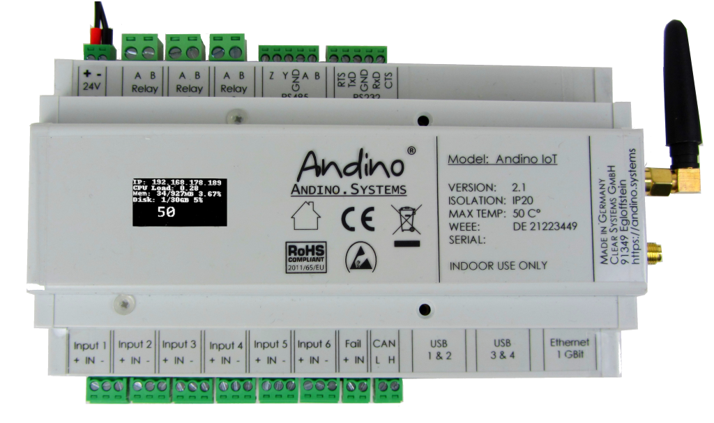
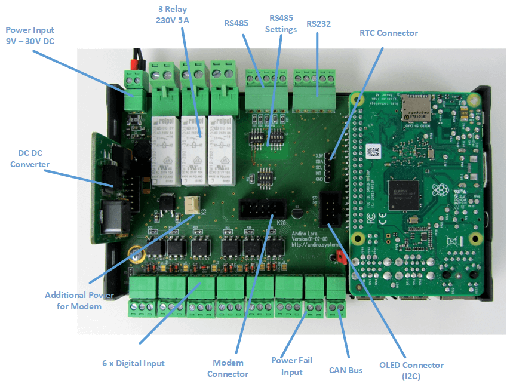
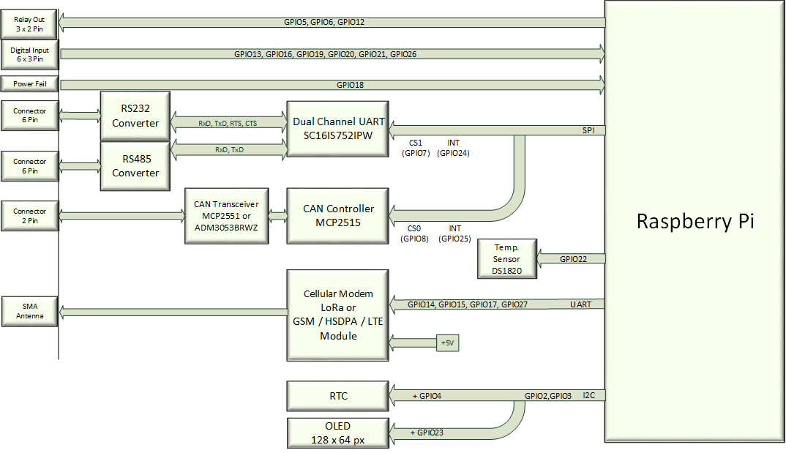
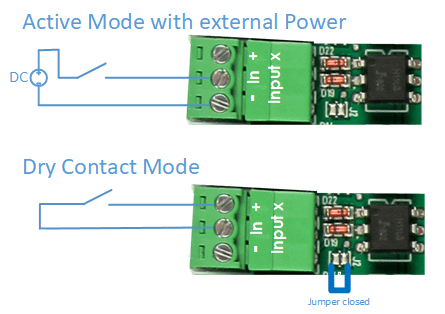
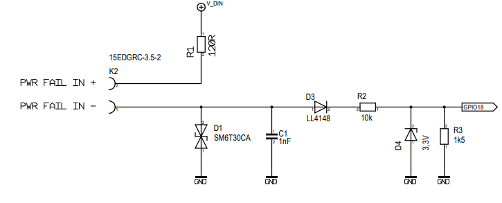
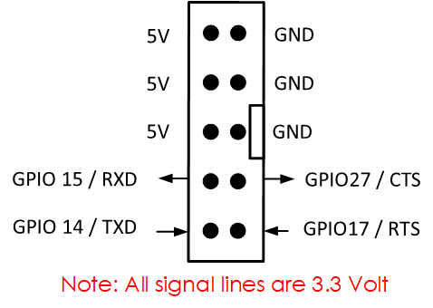
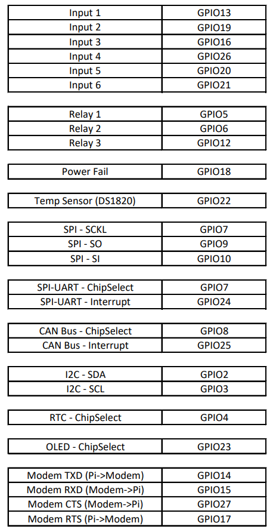

# Andino IO

Homepage of [Andino IO](https://andino.systems/andino-io/)

Tabe of Content
   
1. [Preping Debian](README.md#preparing-debian)
2. [Digital inputs](README.md#digital-inputs)
2. [Relay outputs](README.md#relay-output)
4. [Power Fail Input](README.md#power-fail-input)
5. [RS232](README.md#rs232)
6. [RS485](README.md#rs485)
7. [CAN Bus](README.md#can-bus)
8. [Temperature Sensor](README.md#temperature-sensor)
9. [Modem connector](README.md#modem-connector)
10. [OLED Display](README.md#oled-display)
11. [Real Time Clock RTC DS3231](README.md#real-time-clock-rtc-ds3231)
12. [GPIO Mapping](README.md#gpio-mapping)
13. [WAN Communication](README.md#wan-communication)

## Documentation




----------

----------
### Preparing Debian
1. Release the ttyAMA0 from getty and asign it to GIO14, GPIO15 (used for the Modem) 
2. Add a driver for the SPI UART (RS232 and RS485)
3. Add a driver for the CAN Bus
4. Add a driver for the Temperatur Sensor

#### Download the Driver for the SPI UART

    cd ~/
    wget https://github.com/andino-systems/Andino-IO/raw/master/sc16is752-spi0-ce1.dtbo
    sudo cp sc16is752-spi0-ce1.dtbo /boot/overlays/
    sudo nano /boot/config.txt


Stop getty on serial0:   

    sudo nano /boot/cmdline.txt 

Remove “**console=…**   
dwc_otg.lpm_enable=0 **console=serial0,115200 console=tty1** root=/dev/mmcblk0p2 rootfstype=ext4 .....


    sudo nano /boot/config.txt

add this at the end of the file..

	# -----------------------
	# Andino IO from here
	# -----------------------
	
	# SPI on
	dtparam=spi=on dtoverlay=spi0-cs,cs0_pin=8,cs1_pin=7
	
	# I2C on
	dtparam=i2c_arm=on
	
	# RTC
	# sudo apt-get install -y i2c-tools
	# i2cdetect -y 1
	dtoverlay=i2c-rtc,ds3231
	
	# CAN
	# sudo apt-get install can-utils
	# sudo ip link set can0 up type can bitrate 125000
	# sudo ifconfig
	# cansend can0 456#43414e2054657374
	# candump can0
	dtoverlay=mcp2515-can0,oscillator=16000000,interrupt=25
	
	# 1. UART
	# /dev/ttyAMA0 = Modem
	enable_uart=1
	dtoverlay=pi3-disable-bt-overlay
	dtoverlay=pi3-miniuart-bt
	
	# 2. UART
	# /dev/ttySC0 = RS485
	# /dev/ttySC1 = RS232
	dtoverlay=sc16is752-spi0-ce1
	
	# DS1820 Temp sensor
	# cat   /sys/bus/w1/devices/28-00000a990ab5/w1_slave
	dtoverlay=w1-gpio-pullup,gpiopin=22,extpullup=on
	dtoverlay=w1-gpio,gpiopin=22


After that reboot. Now we are ready to go!


### Digital Inputs
The digital inputs are connected to the GPIO:

- Input1:	GPIO13
- Input2:	GPIO19
- Input3:	GPIO16
- Input4:	GPIO26
- Input5:	GPIO20
- Input6:	GPIO21

The Inputs are calculated for ****24 Volt**** Input.
Normaly a signal of 24 Volt is applied to Pin 2 and the Ground to Pin 3. (active Mode)

By closing the JumperX the Inputs can be driven in passive Mode or Dry Contact.
This means a Switch / Relaycontact can be conneted between Pin 3 and Pin 2.
 



----------
### Relay Output
The Relay are controlled by the GPIO:

- Relay1:	GPIO5
- Relay2:	GPIO6
- Relay3:	GPI12

		# Export
		sudo echo "5" > /sys/class/gpio/export
		sudo echo "6" > /sys/class/gpio/export
		sudo echo "12" > /sys/class/gpio/export
		# Set to output
		sudo echo "out" > /sys/class/gpio/gpio5/direction
		sudo echo "out" > /sys/class/gpio/gpio6/direction
		sudo echo "out" > /sys/class/gpio/gpio12/direction
		# Switch on
		echo "1" > /sys/class/gpio/gpio5/value
		echo "1" > /sys/class/gpio/gpio6/value
		echo "1" > /sys/class/gpio/gpio12/value
    
The Relays can drive 230V and up to 5 ampere. 
There a no Fuses at the relay contacts!!

----------
### Power Fail Input
The Power Fail Input can be used to inform the Raspberry about a Mains Power loss.
This can be done by a Switch- / Relay-Contact.
Just bridge Pin1 and Pin2 to signal Power good/fail.

- Fail Input:	GPI18


  

[This feature can be used together with the Andino UPS](https://andino.systems/andino-ups/)  

	sudo echo "18" > /sys/class/gpio/export
	sudo echo "in" > /sys/class/gpio/gpio21/direction
	cat /sys/class/gpio/gpio18/value

----------
### RS232

The RS232 and RS485 based on the SPI Uart from NXP [SC16IS752][1].

After prepare the Debian for the use of the SPI Uart (see Prepare Debian) the **/dev/ttySC1** is the RS232 Channel.
The Signals on the RS232 Port are +-12 Volt.

#### Test the UART with python

You can exit minicom with CTRL-A then X

    sudo apt-get install minicom
    sudo nano minicom –setup
    # press Serial Port Setup

    +-----------------------------------------------------------------------+
    | A -    Serial Device      : /dev/ttySC1                               |
    | B - Lockfile Location     : /var/lock                                 |
    | C -   Callin Program      :                                           |
    | D -  Callout Program      :                                           |
    | E -    Bps/Par/Bits       : 38400 8N1                                 |
    | F - Hardware Flow Control : No                                        |
    | G - Software Flow Control : No                                        |
    |                                                                       |
    |    Change which setting?                                              |
    +-----------------------------------------------------------------------+
            | Screen and keyboard      |
            | Save setup as dfl        |
            | Save setup as..          |
            | Exit                     |
            | Exit from Minicom        |
            +--------------------------+

#### Test the UART with python

	sudo apt-get install python-serial

after that you can send data:

	import serial
	import time
	
	ser = serial.Serial(
	               port="/dev/ttySC1",
	               baudrate = 9600,
	               parity=serial.PARITY_NONE,
	               stopbits=serial.STOPBITS_ONE,
	               bytesize=serial.EIGHTBITS,
	               timeout=3
	           )
	
	
	
	for i in range(2):
	        ser.setRTS(False)
	        time.sleep(0.01)
	        ser.write(str(i)+ b"Hello 232\n")
	        time.sleep(0.1)
	        s = ser.readline()
	        print( s.rstrip() )
	        ser.setRTS(True)
	ser.close()


----------
### RS485

After prepare the Debian for the use of the SPI Uart (see Prepare Debian) the **/dev/ttySC0** is the RS485 Channel.
It can be used as full duplex RS422 or as two wire RS485.
In RS485 Mode the transmitter can be switched on either by the RTS signal or automaticaly.

#### Jumper


Send in manual mode

	for i in range(2):
			# Transmitter on
	        ser.setRTS(False)
	        time.sleep(0.01)
	        ser.write(str(i)+ b"Hello 485\r\n")
	        time.sleep(0.1)
	        s = ser.readline()
	        print( s.rstrip() )
			# Transmitter off
	        ser.setRTS(True)

Send in RS485 Auto mode

	for i in range(2):
	        ser.write(str(i)+ b"Hello 485\r\n")
	        time.sleep(0.1)
	        s = ser.readline()
	        print( s.rstrip() )


----------
### CAN Bus

The CAN Bus based on the Microchip MCP2515 and the Tranceiver MCP2551.
It is supported by the Raspberry Pi.
 
	sudo apt-get install can-utils
	sudo ip link set can0 up type can bitrate 125000
	sudo ifconfig can0
	cansend can0 456#43414e2054657374
	# or
	candump can0

----------
### Temperature Sensor

The Device has a Build in temperatur Sensor DS1820.
The Sensor is wired to GPIO 22.

	ls /sys/bus/w1/devices/
	cat   /sys/bus/w1/devices/28-00000a990ab5/w1_slave
	6a 01 4b 46 7f ff 06 10 5f : crc=5f YES
	6a 01 4b 46 7f ff 06 10 5f t=22625

This is 22.6225 Degrees Celsius 

----------
### Modem connector

The Modem is connected to the internal UART of the Raspberry Pi.

**/dev/ttyAMA0**

This Port has to configured to GPIO14 and GPIO15 (see Prepare Debian)
 
- GPIO14 (TxD) 
- GPIO15 (RxD)
- GPIO17 (RTS output / also used to Reset the Modem)
- GPIO27 (CTS input)



#### Testing the modem and porgramming(/scripting) with it
You can find some example python scripts in this folder of the repository. You can test the modem with a simple python script:

```python
#!/usr/bin/python
# -*- encoding: utf-8 -*-
import time
import serial

def send(data):
   p = serial.Serial("/dev/ttyAMA0" , 57600 )
   p.setRTS(False)
   time.sleep(2)
   p.write(data+"\x0d\x0a")
   data.rstrip()
   print(data)
   time.sleep(2)
   rdata=p.readline()
   rdata=rdata[:-1]
   print rdata

send("sys reset")

time.sleep(1)

send("mac get deveui")
```
And then, in a new terminal, you can get the eui from the device:
```bash
$ python get-deveui.py
sys reset
RN2483 1.0.4 Oct 12 2017 14:59:25
mac get deveui
0004A30B002544A2
```

----------
### OLED Display

The OLED Display is connected via the I2C Bus with the address 68.
The resulution of the Display is 64x128 Pixel.

Check the I2C Devices

	apt-get install -y i2c-tools
	i2cdetect -y 1

	     0  1  2  3  4  5  6  7  8  9  a  b  c  d  e  f
	00:          -- -- -- -- -- -- -- -- -- -- -- -- --
	10: -- -- -- -- -- -- -- -- -- -- -- -- -- -- -- --
	20: -- -- -- -- -- -- -- -- -- -- -- -- -- -- -- --
	30: -- -- -- -- -- -- -- -- -- -- -- -- 3c -- -- --
	40: -- -- -- -- -- -- -- -- -- -- -- -- -- -- -- --
	50: -- -- -- -- -- -- -- -- -- -- -- -- -- -- -- --
	60: -- -- -- -- -- -- -- -- UU -- -- -- -- -- -- --
	70: -- -- -- -- -- -- -- --
	
0x3C is the OLED-Display 0x68 is the RTC

#### Install some Tools and Samples

	sudo apt-get install -y git
	sudo apt-get install -y python-dev python3-dev
	sudo apt-get install -y python-imaging python-smbus i2c-tools
	sudo apt-get install python-setuptools

	git clone https://github.com/adafruit/Adafruit_Python_SSD1306.git
	cd Adafruit_Python_SSD1306
	sudo python setup.py install
	nano  /home/pi/Adafruit_Python_SSD1306/examples/stats.py

uncomment disp = Adafruit_SSD1306.SSD1306_128_64(rst=RST)
and comment any other disp..

	python /home/pi/Adafruit_Python_SSD1306/examples/stats.py
   
### Real Time Clock RTC DS3231

Execute this

	sudo -s
	chmod +x /etc/rc.local 
	apt-get purge -y fake-hwclock 
	apt-get remove fake-hwclock -y 
	dpkg --purge fake-hwclock 
	rm -f /etc/adjtime. 
	cp /usr/share/zoneinfo/Europe/Berlin /etc/localtime
	ln -s /home/pi/bin/ntp2hwclock.sh /etc/cron.hourly/ntp2hwclock
	sudo reboot now

	hwclock -w
	hwclock -r

This Python script sets the NTP Time to the HWClock as long a NTP connection can established.
Place this script at /home/pi/bin/ntp2hwclock.sh (for example, see above)

	#!/bin/bash
	# Location of logfile
	LOGFILE="/usr/local/oeebox/etc/log/ntp.log"
	if [ ! -f $LOGFILE ]; then
	  touch $LOGFILE
	fi
	# Set the maximum allowed difference in seconds between Hw-Clock and Sys-Clock
	maxDiffSec="2"
	msgNoConnection="No connection to time-server"
	msgConnection="Connection to time-server"
	# Check for NTP connection
	if ( ntpq -p | grep -q "^*"  ); then
	        echo $msgConnection >> $LOGFILE
	        echo "---------------------------------"  >> $LOGFILE
	        secHwClock=$(sudo hwclock --debug | grep "^Hw clock time" | awk '{print $(NF-3)}')
	        echo "HwClock: $secHwClock sec" >> $LOGFILE
	        secSysClock=$(date +"%s")
	        echo "SysClock: $secSysClock sec" >> $LOGFILE
	        echo "---------------------------------" >> $LOGFILE
	        secDiff=$(($secHwClock-$secSysClock))
	        # Compute absolute value
	        if ( echo $secDiff | grep -q "-" ); then
	            secDiff=$(echo $secDiff | cut -d "-" -f 2)
	        fi
	        echo "Difference: $secDiff sec" >> $LOGFILE
	        msgDiff="HwClock difference: $secDiff sec"
	        if [ "$secDiff" -gt "$maxDiffSec" ] ; then
	                echo "---------------------------------" >> $LOGFILE
	                echo "The difference between Hw- and Sys-Clock is more than $maxDiffSec sec." >> $LOGFILE
	                echo "Hw-Clock will be updated" >> $LOGFILE
	                # Update hwclock from system clock
	                sudo hwclock -w
	                msgDiff="$msgDiff --> HW-Clock updated." >> $LOGFILE
	        fi
	        if !(awk '/./{line=$0} END{print line}' $LOGFILE | grep -q "$msgConnection") || [ "$secDiff" -gt "$maxDiffSec" ]; then
	                echo $(date)": "$msgConnection". "$msgDiff >> $LOGFILE
	        fi
	else
	        # No NTP connection
	        echo $msgNoConnection
	        if !(awk '/./{line=$0} END{print line}' $LOGFILE | grep -q "$msgNoConnection"); then
	                echo $(date)": $msgNoConnection" >> $LOGFILE
	        fi
	fi


### GPIO Mapping




----

# WAN Communication

To enable WAN communication, please refer to the following setup tutorials:

#### 2G modem

- [Setup PPP for the 2G/EDGE SimCom SIM800L or 4G on the SIM7600E Modem](../../Andino-Common/Extensions/2G-Modem-SIM800L/ppp)

#### 4G modem

- [SimCom SIM7600E: Setting up via QMI](../../Andino-Common/Extensions/4G-Modem-SIM7600/qmi) (recommended)
- [SIM7600E: Setup via ppp (4G/LTE Modem)](../../Andino-Common/Extensions/4G-Modem-SIM7600/ppp) (not recommended)


