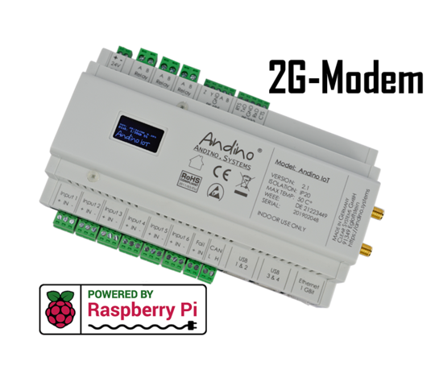

Andino IO with Raspberry Pi, 2G Modem, Heatsink and RTC
======

The [Andino IO][1] is a motherboard for the Raspberry Pi. It allows mounting on a DIN rail in the control cabinet.

**The setup documentation section can be found at the bottom!**

  

### Andino IO
The [Andino IO][1] is a microcontroller board for the Raspberry Pi in a DIN-rail housing for installation in a control cabinet. It is used to adapt digital inputs and outputs for a voltage of 24 V. It also contains a Raspberry Pi. The inputs and outputs as well as the power supply of the Pi are optimally protected. Communication between the microcontroller and the Pi takes place via the UART interface.

**For a general introduction on the Andino IO board, see [Andino IO](../../)**

### 2G Connectivity
The 2G modem is connected to the UART RS232-WAN extension as descibed in Dual Channel UART RS232-WAN Extension. Using an EDGE connection it can be used to send and receive SMS messages as well as for basic data transfer at a speed of up to 220 kbit/s in ideal conditions.

### Setup documentation

- [Andino IO: BaseBoard Setup](../../BaseBoard)
- [How to set up the 2G modem](../../../Andino-Common/Extensions/2G-Modem-SIM800L)
- [How to send / receive SMS](../../../Andino-Common/Extensions/2G-Modem-SIM800L/sms)
- [How to set up ppp and connect to the internet](../../../Andino-Common/Extensions/2G-Modem-SIM800L/ppp)

### Programming examples

- [Using NodeRed with the Andino X1](../../../Andino-Common/src/NodeRed) 
- [Using NodeRed to send and receive SMS](../../../Andino-Common/src/NodeRed/AndinoSMS/node-red-contrib-andino-sms) 

Author
-----

* 2020 by AndinoSystems
* [Contact us by email](mailto:info@andino.systems)

[1]:https://andino.systems/andino-io/

