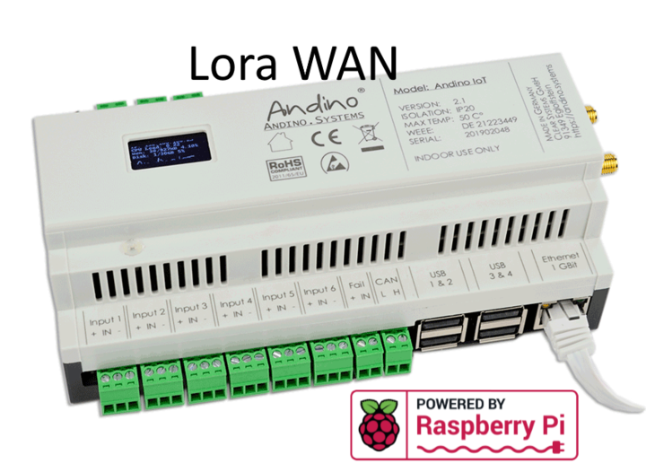

Andino IO with Raspberry Pi, LoRaWAN Modem, Heatsink and RTC
======

The [Andino IO][1] is a motherboard for the Raspberry Pi. It allows mounting on a DIN rail in the control cabinet.

**The setup documentation section can be found at the bottom!**

  

### Andino IO
The [Andino IO][1] is a microcontroller board for the Raspberry Pi in a DIN-rail housing for installation in a control cabinet. It is used to adapt digital inputs and outputs for a voltage of 24 V. It also contains a Raspberry Pi. The inputs and outputs as well as the power supply of the Pi are optimally protected. Communication between the microcontroller and the Pi takes place via the UART interface.

**For a general introduction on the Andino IO board, see [Andino IO](../../)**

### LoraWAN connectivity
The LoraWAN modem is connected to the UART RS232-WAN extension as descibed in Dual Channel UART RS232-WAN Extension.

### Setup documentation

- [Andino IO: BaseBoard Setup](../../BaseBoard)
- [LoraWAN modem (RN2483): Setup & documentation](../../../Andino-Common/Extensions/LoRaWAN-Modem)

Author
-----

* 2020 by AndinoSystems
* [Contact us by email](mailto:info@andino.systems)

[1]:https://andino.systems/andino-io/

