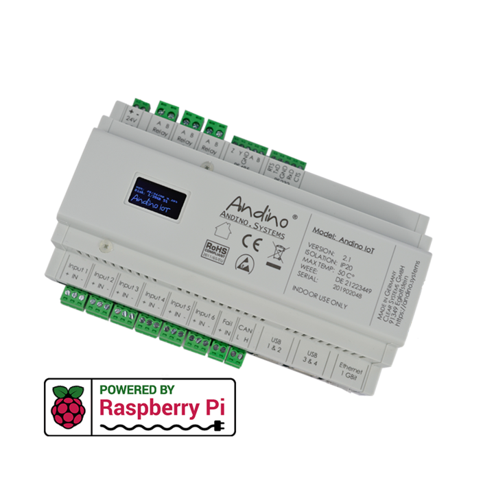

Andino IO
==========

**For full documentation and setup tutorials on the Andino IO, please refer to our documentation website [andino.systems](https://andino.systems/andino-io).**

  

The [Andino IO][1], like its little brother Andino X1, is a motherboard for the Raspberry Pi. It allows mounting on a DIN rail in the control cabinet.

## Overview

The [Andino IO][1] is a microcontroller board for the Raspberry Pi in a DIN-rail housing for installation in a control cabinet. It is used to adapt digital inputs and outputs for a voltage of 24 V. It also contains a Raspberry Pi. The inputs and outputs as well as the power supply of the Pi are optimally protected. Communication between the microcontroller and the Pi takes place via the UART interface.

The sensitive GPIO of the Raspberry Pi are protected. Fast signals can be precisely detected by the microcontroller. Actuators and sensors can be electrically connected to the Raspberry Pi. It provides an industrial power supply for the Raspberry Pi. Customized adapters from the Raspberry Pi GPIO or the micro controller IO can be connected electrically to terminals. Provides mounting on a DIN rail for installation in manifolds.

Some possible applications for the IO include:

* Production Machines
* Energy data monitoring
* Capture environmental data Interface conversions

## Software & Drivers

All software and drivers can be found as downloads above or in the [Andino Common section](https://github.com/andino-systems/Andino/tree/master/Andino-Common) of the repository. However, for more information and up-to-date documentation for your specific hardware configuration, please [visit our website](https://andino.systems/andino-io/andino-io-overview) and choose your hardware configuration from the list.

## Author

* 2020 by AndinoSystems
* [Contact us by email](mailto:info@andino.systems)

[1]:https://andino.systems/andino-io/

