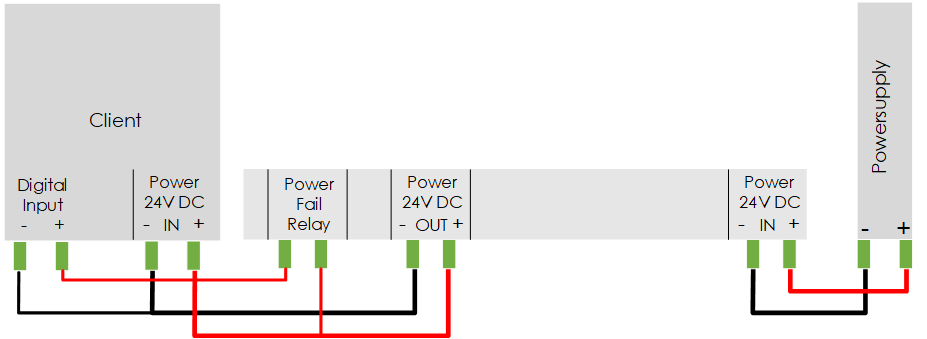
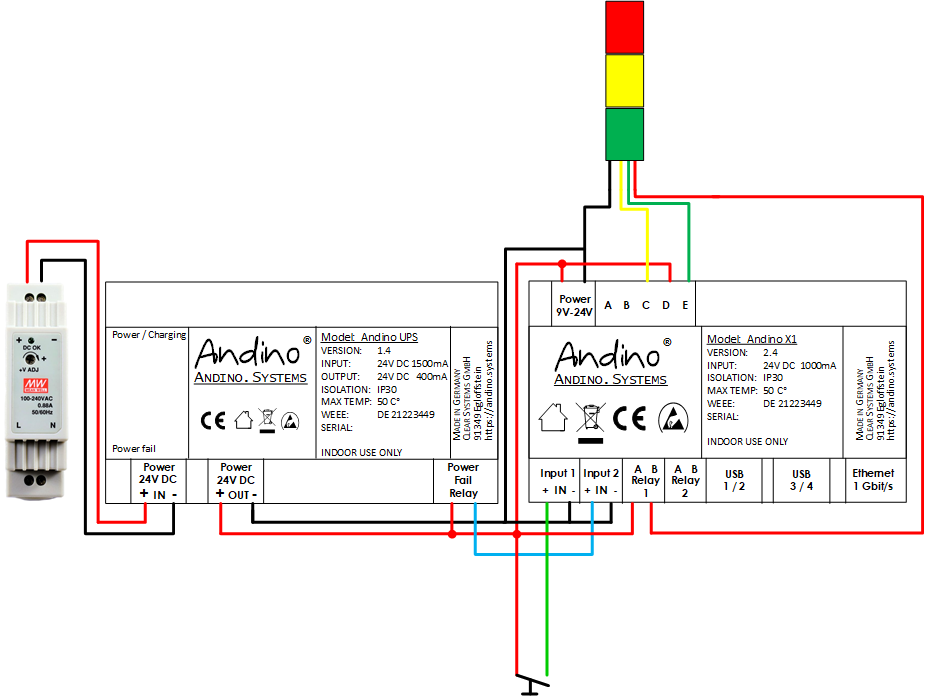
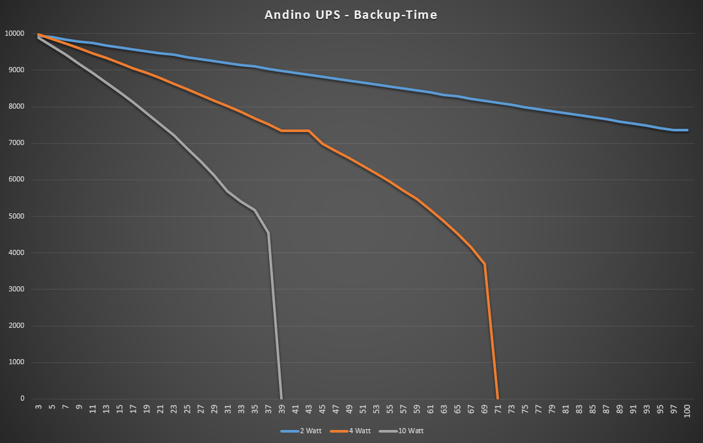
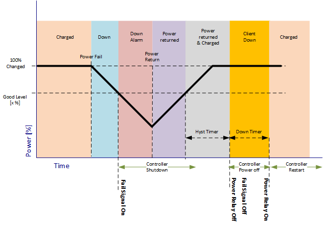
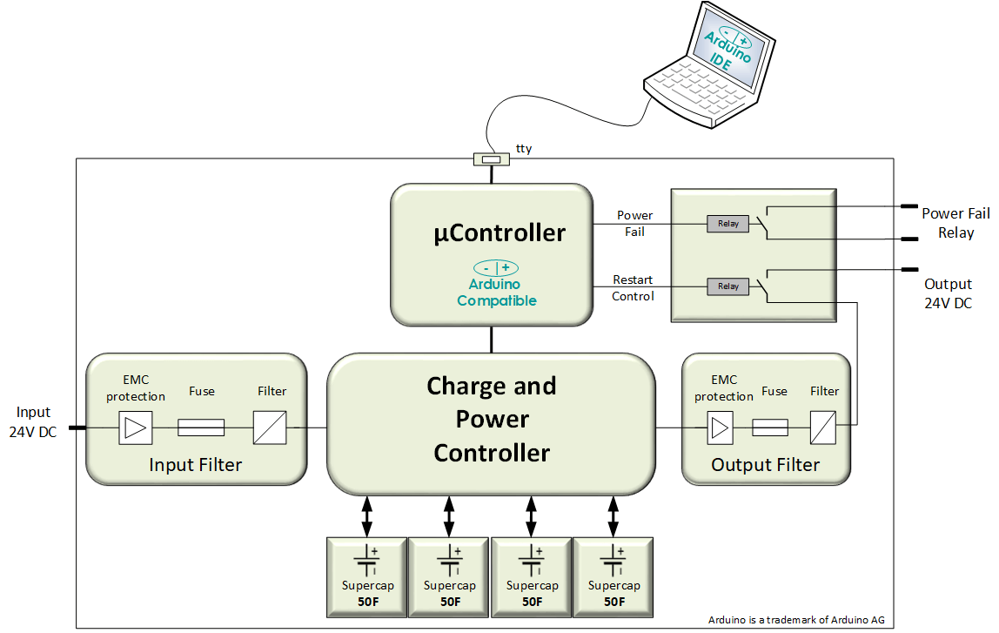

Andino-UPS
======

**This page provides a general introduction about the Andino UPS. For more technical documentation and details about the mode of operation of the firmware, refer to [Andino-UPS (Uninterruptible Power Supply) Firmware](./firmware)**

Andino UPS is an Uninterruptible Power Supply for 24 Volt DC Client Devices.
It stores the Energy in long lasting Supercaps instead of Lead- or Lithium Batteries.
Depending on the environment temperature, the lifetime can reach up to 10 years without any maintenance. 

## Overview

This UPS is designed for industrial PLC and other devices powered with 24 V DC.
It is intended to allow the client device to bridge over short voltage drops and, in the event of a prolonged power failure, to shut down in a controlled manner.

Thus, the controlled device can close databases, connections and synchronize the file system without the risk of data loss.

The Andino UPS has an 24V DC Input and a 24V DC Output. 
This reduce the Energy loos for the conversion to mains power and backwards.

The UPS can deliver up to 10 Watts or 0,4 Ampere at 24 Volts.

## Wiring

### ..with any 24 Volt Client Device

### Wiring together with Andino X1 (OEE.Box)

## Backup times

Depending on the Load the backup times are:

2 Watts: 3 min 30 sec

4 Watts: 1 min 12 sec

10 Watts: 39 sec

   
## Shutdown - Power return and Bridge Mode

If the Charge Level is above the "Good" Level (witch is default 80% and you can change) the Client will not informed of the Power Fail. If the Power returns within this time, the gap is bridged. 

If the Power returns after the Client is informed, the UPS will wait until the Charge Level is again above the good Level and give the Client time to Shut down (HYST-Timer).
After that the Power of the Client will be shut down (DOWN Timer) and switched on again so that the client can restart. 

## EMC Tests

The Andino UPS has been extensively tested for its electromagnetic compatibility (EMC).

The tests were based on the immunity to electrostatic discharge, high-frequency electromagnetic fields, fast transient electrical disturbances (burst), impulse voltages, conducted disturbances – induced by high-frequency fields and magnetic fields with energy-related frequencies.

The tested standards in detail

	Radiated field strength / conducted emissions
	DIN EN 55022: 2011 according to VDE 0875 part 22 of 12.2011
	Störaussendung: Klasse B (Wohnbereich) (strengere Grenzwerte) 
	Störfestigkeit: Klasse A (Industriebereich) herangezogen. (höhere Einstrahlung)
	
	Immunity ESD
	DIN EN 61000-4-2: 2009 according to VDE 0847 part 4-2 of 12.2009
	
	Immunity radiated electromagnetic fields
	DIN EN 61000-4-3: 2006+A1:2008+ A2: 2010 according to VDE 0847 part 4-3 of 04.2011
	
	Immunity Burst
	DIN EN 61000-4-4: 2012 according to VDE 0847 part 4-4 of 04.2013
	
	Immunity Surge
	DIN EN 61000-4-5: 1995 +A1: 2014 according to VDE 0847 part 4-5 of 03.2015
	
	Immunity high frequent uncoupled emission
	DIN EN 61000-4-6: 2014 according to VDE 0847 part 4-6 of 08.2014
	
	Immunity magnetic fields
	DIN EN 61000-4-8: 2010 according to VDE 0847 part 4-8 of 11.2010

## Block diagram

  
**For a description of the internal charge and power controller [see here](https://www.analog.com/media/en/technical-documentation/data-sheets/3350fc.pdf)** 
