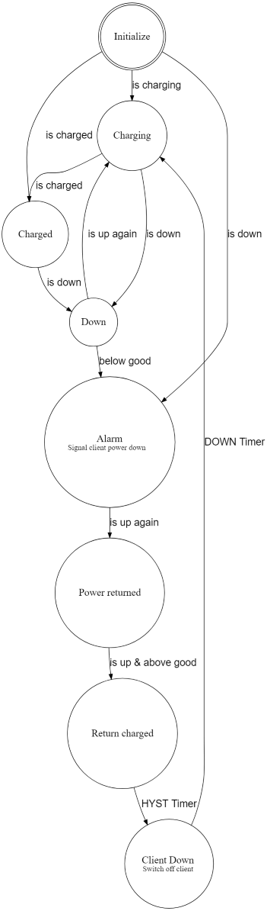
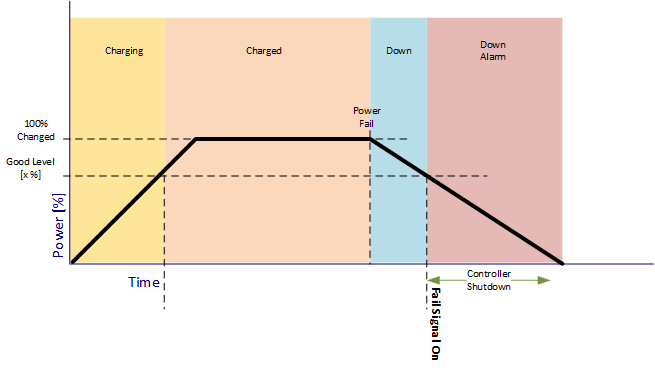
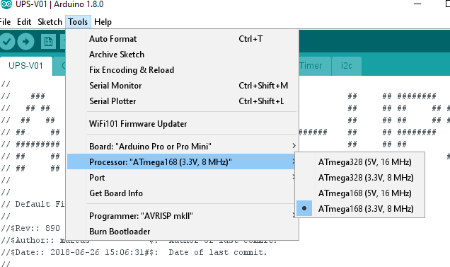
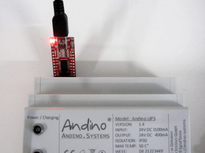

Andino-UPS (Uninterruptible Power Supply) Firmware
======

**This page provides technical setup information for the Andino-UPS. For a general introduction on the product, please refer to [Andino-UPS](../)**

Tabe of Content   
   
1. [The initial Firmware](README.md#the-initial-firmware)
2. [Commands to the UPS](README.md#commands-to-the-ups)
3. [Messages from the UPS](README.md#messages-from-the-ups)
4. [How to change the Firmware](README.md#how-to-change-the-firmware)
5. [Setup the Arduino Development Tool](README.md#setup-the-arduino-development-tool)
6. [Use the USB Converter](README.md#use-the-usb-converter)

---

## The initial Firmware

The default firmware, witch is inital delivered uses 38400 Baud to communicate with the PC

This is what the Firmware do:
   
1. Track the Powerdown Signal from the Power-Controller
2. Read cyclical the Super-Cap voltage
3. Controls the Power Fail Signal for the Client
4. Controls the Power Down Relay to shut down / restart the Client  
4. Controlls the LEDs
5. Communicate via the ttyX or COMx interface with a PC (or simular) [see here how to connect](README.md#use-the-usb-converter) 

The Firmware is written as a Finite State Machine (FSM)
It consits of states witch handles Events witch causes Actions and State transitions.

### FSM State Machine

### Interface, Commands

All commands or messages are sent and received via the UART  
All character are ASCII.    
Every command has to be terminated by CR or LF. Message ends with CR and LF.

### Commands to the UPS
**Command** | Arguments | Action | Default | Example 
--- | --- | --- | ---
RESET | none | Restart the Controller | - |  RESET
INFO | none| Prints the current settings | - |   INFO
HELP | none| Prints the current settings | - |  INFO
TRCE | 0=no, 1=yes | Write Trace informations of the FSM to the UART |0|  TRCE 1
REGS | none | Dumps the internal registers in JSON format | - |  REGS
GOOD | 20..98 | Sets the Power good level in %  | 80 | GOOD 50
HYST | 1..100 | Sets the Timer for the Shutdown of the Client | 5 | HYST 10
DOWN | 1..100 | Sets the Timer for the Power off Client to Restart | 5 | DOWN 10

### Register dump

Send the Command REGS\r\n and the device will answer with a JSON Block

	{
	"chrg_sts": 0b0001010010100101,
	"moni_sts": 0b0000001000000000,
	"vc1": 2132,
	"vc2": 2617,
	"vc3": 2617,
	"vc4": 2617,
	"vin": 23848,
	"vcap": 9985,
	"vout": 23799,
	"iin": 26,
	"ichg": 0,
	"temp": 25,
	"index":0
	}

| Name | Description
--- | ---
chrg_sts | 	Charge Status Register
moni_sts | Monitor Status Register
vc1 | Voltage CAP1
vc2 | Voltage CAP2
vc3 | Voltage CAP3
vc4 | Voltage CAP1
vin | Input Voltage
vcap | Total CAP Voltage
vout | Output Voltage
iin | Input Current in mA
ichg | Charge Current in mA
temp | Core Temperature in C
index | upcounting message counter

For more details please [see here](http://www.analog.com/media/en/technical-documentation/data-sheets/3350fc.pdf) 

### Messages from the UPS

If you enable the Trace "TRCE 1" this will be written:
State / Event 	Value
or State -> State transitions

	Init / Enter  Val: 0
	Init -> Charging
	Init / Leave  Val: 0
	Charging / Enter  Val: 0
	Charging / Up  Val: 10
	Charging / Level  Val: 6590
	Charging / Level  Val: 6890
	Charging / Level  Val: 7180
	Charging / Level  Val: 7450
	Charging / Level  Val: 7730
	Charging / Level  Val: 7930
	Charging / Level  Val: 8170
	Charging / Level  Val: 8370
	Charging / Level  Val: 8580
	Charging / Level  Val: 8780
	Charging / Level  Val: 9000
	Charging / Level  Val: 9180
	Charging / Level  Val: 9340
	Charging / Level  Val: 9520
	Charging -> Charged
	Charging / Leave  Val: 0
	Charged / Enter  Val: 0
	Charged / Level  Val: 9680
	Charged / Level  Val: 9870
	Charged / Level  Val: 9990
	Charged / Level  Val: 9980
	Charged / Level  Val: 9990
	Charged / Down  Val: 0
	Charged -> Down
	Charged / Leave  Val: 0
	Down / Enter  Val: 0
	Down / Level  Val: 9920
	Down / Level  Val: 9860
	Down / Level  Val: 9820
	Down / Up  Val: 10
	Down -> Charging
	Down / Leave  Val: 0
	Charging / Enter  Val: 0
	Charging / Level  Val: 9920
	Charging -> Charged
	Charging / Leave  Val: 0
	Charged / Enter  Val: 0
	Charged / Level  Val: 9990

## How to change the Firmware

### Setup the Arduino Development Tool

To develop or change the Firmware for the Andino UPS from a PC, please follow this steps:

1. Download the Arduino IDE [here](https://www.arduino.cc/en/main/software)
2. Download the Firmware and save it in an Folder named UPS-V01
3. Setup the Arduino IDE. (below)
4. [Use the USB-TTL Uart adapter](https://clearsystems.de/shop/product/ftdi-232-adapter/)

### Setup the IDE

The Andino UPS allows to program the Atmel Controller from the Raspberry Pi with avrdude or from a PC via a USB Adapter.  

[here](https://www.arduino.cc/en/main/software)

### Use the USB Converter

Insert the Adapter at the upper side of the Andino UPS (6-pin slot)  

  

    

Author
-----

* 2020 by AndinoSystems
* [Contact us by email](mailto:info@andino.systems)

[2]:https://github.com/andino-systems/Andino-X1
