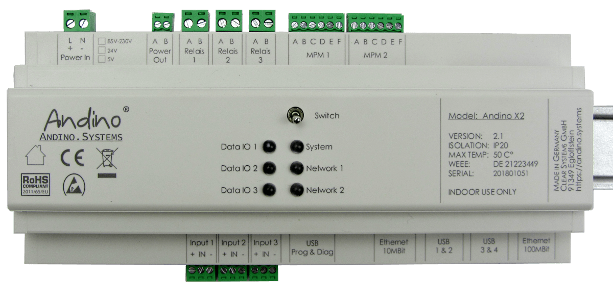
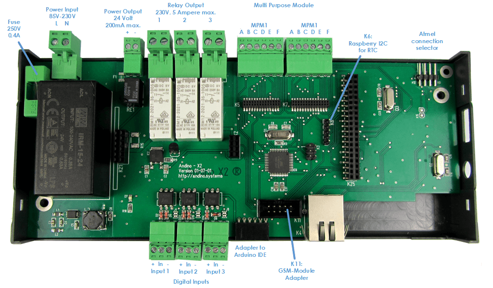
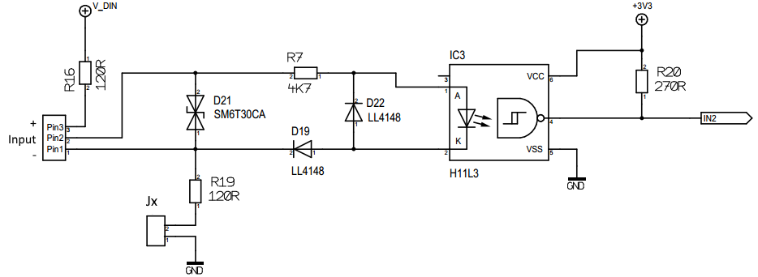
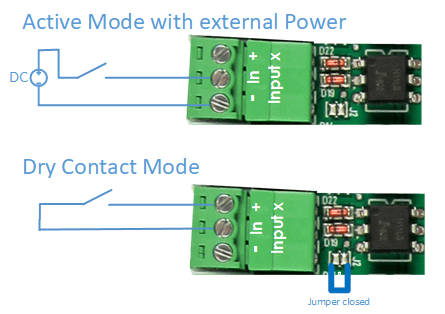
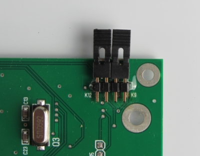
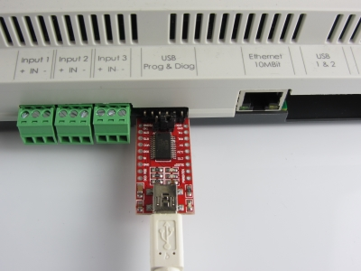
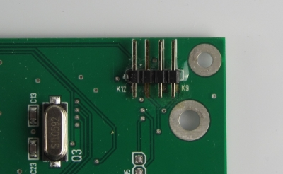
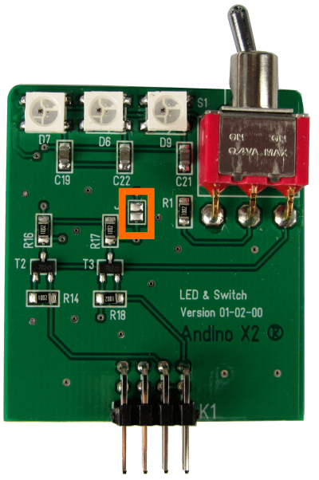
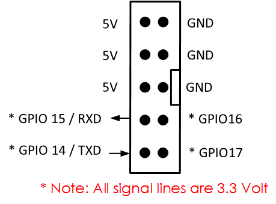

Andino X2: Technical Documentation
======

**This page provides Technical documentation on the Andino X2 board. For a general introduction, refer to [Andino-X2](../). For a setup tutorial on the Andino-X2 firmware, see [Andino-X2: Firmware](../src/firmware).**

Table of Contents
   
1. [Digital inputs](README.md#digital-inputs)
2. [Relay outputs](README.md#relay-output)
3. [Preparing Debian](README.md#preparing-debian)
4. [Enable UART to GPIO](README.md#enable-uart-to-gpio)
5. [Add the Driver for the SPI UART](README.md#add-the-driver-for-the-spi-uart)
6. [Add a driver for the SPI Ethernet controller](README.md#add-a-driver-for-the-spi-ethernet-controller)
7. [Add the Driver for the RTC DS3231](README.md#add-the-driver-for-the-rtc-ds3231)
8. [Communication with the Atmel Controller](README.md#communication-with-the-atmel-controller)
9. [Atmel Controller <-> Raspberry Pi](README.md#atmel-controller-and-raspberry-pi)
10. [Atmel Controller <-> PC via USB](README.md#atmel-controller-and-pc-via-usb)
11. [Drive the LED from Raspberry](README.md#drive-the-led-from-raspberry)
12. [Setting up the 2G Modem (SIMCom800L)](README.md#setting-up-the-2G-modem-(simcom800l))
13. [Schematics of the Andino X2](README.md#schematics)

## Physical layout

----------

### Digital Inputs
The digital inputs are connected to the Atmel Controller.  
The default firmware will debounce the inputs and send changes and a change counter cyclical to the Pi.
  
The Inputs are calculated for ****24 Volt**** Input.  

The Inputs can be driven by an external power supply (active mode) or with a "dry contact" with the internal voltage.   
For the  "dry contact" the internal jumper has to be closed. This will connect the "minus" contact with the ground of the board so this not a 100% isolated mode.   

----------
### Relay Output
The Ralay are also controlled by the Atmel Controller. The default firmware can turn them on/off or pulse them.  
This will be done by the command:   
    REL1 1   
    REL1 0   
    REL2 1   
    REL2 0   
    RPU1 1500   
PRU1 1500 Pulses the relay 1 for 1500 ms.

For a detailed description of the firmware, please see [here](../src/firmware).

### Preparing Debian
1. Release the ttyAMA0 from getty and asign it to GIO14, GPIO15
2. Add a driver for the SPI UART
3. Add a driver for the SPI Ethernet controller

#### Enable UART to GPIO

The UART on the GPIO is used for the 2G/GPRS Modem.
First, edit the */boot/config.txt*: 

    sudo nano /boot/config.txt

Move to the bottom of the file and add this:

    enable_uart=1   
    dtoverlay=pi3-disable-bt-overlay
    dtoverlay=pi3-miniuart-bt  
 
Save and quit.

Now, stop getty on serial0. To do this, first edit */boot/cmdline.txt*:   

    sudo nano /boot/cmdline.txt 

Remove the entries starting with *console=...*. Entries that need to be removed in the example below are marked with >>entry<<.

	dwc_otg.lpm_enable=0 >>console=serial0,115200 console=tty1<< root=/dev/mmcblk0p2 rootfstype=ext4 .....

Save and exit.

#### Add the Driver for the SPI UART

The first channel goes to the MPM Slot 1.
The second  channnel of the SPI UART is used to communicate with the Atmel Controller.

    cd ~/
    wget https://github.com/andino-systems/Andino-X2/raw/master/src/sc16is752-spi0-ce1.dtbo
    sudo cp sc16is752-spi0-ce1.dtbo /boot/overlays/
    sudo nano /boot/config.txt
Add or uncomment this  

    dtparam=spi=on
    dtoverlay=sc16is752-spi0-ce1

Then reboot:
    
    sudo reboot now

Check if the devices are showing up.

    ls /dev/ttySC*

ls should return two entries, namely *ttySC0* for MPM1 and *ttySC1* for the Arduino.

#### Test UART

    sudo nano minicom –-setup

Navigate to *Serial Port Setup* and change the settings to the following:

    +-----------------------------------------------------------------------+
    | A -    Serial Device      : /dev/ttySC1                               |
    | B - Lockfile Location     : /var/lock                                 |
    | C -   Callin Program      :                                           |
    | D -  Callout Program      :                                           |
    | E -    Bps/Par/Bits       : 38400 8N1                                 |
    | F - Hardware Flow Control : No                                        |
    | G - Software Flow Control : No                                        |
    |                                                                       |
    |    Change which setting?                                              |
    +-----------------------------------------------------------------------+
            | Screen and keyboard      |
            | Save setup as dfl        |
            | Save setup as..          |
            | Exit                     |
            | Exit from Minicom        |
            +--------------------------+

You can exit minicom by pressing *Ctrl+A*, followed by *x*.

#### Add a driver for the SPI Ethernet controller

To add the driver, first edit the /boot/config.txt:

    sudo nano /boot/config.txt

Navigate to the end of the file and add 
 
	dtoverlay=enc28j60

Now reboot.

    sudo reboot now

After the reboot is complete, run *ifconfig* and check if the interface shows up correctly:

    ifconfig
    eth0: flags=4163<UP,BROADCAST,RUNNING,MULTICAST>  mtu 1500
    inet 192.168.178.74  netmask 255.255.255.0  broadcast 192.168.178.255
    inet6 fe80::50a1:6c17:239b:847c  prefixlen 64  scopeid 0x20<link>
    ether b8:27:eb:45:a3:bc  txqueuelen 1000  (Ethernet)
    RX packets 2077  bytes 186482 (182.1 KiB)
    RX errors 0  dropped 3  overruns 0  frame 0
    TX packets 1649  bytes 257186 (251.1 KiB)
    TX errors 0  dropped 0 overruns 0  carrier 0  collisions 0
    
    eth1: flags=4099<UP,BROADCAST,MULTICAST>  mtu 1500
    ether c6:97:8d:3a:22:b6  txqueuelen 1000  (Ethernet)
    RX packets 0  bytes 0 (0.0 B)
    RX errors 0  dropped 0  overruns 0  frame 0
    TX packets 0  bytes 0 (0.0 B)
    TX errors 0  dropped 0 overruns 0  carrier 0  collisions 0
    device interrupt 191
    
#### Add the Driver for the RTC DS3231

Enable I2C and add the Module the RTC DS3231

	sudo nano /boot/config.txt
uncomment dtparam=i2c_arm=on and add the dtoverlay=i2c-rtc,ds3231

	dtparam=i2c_arm=on
	#dtparam=i2s=on
	#dtparam=spi=on
	dtoverlay=i2c-rtc,ds3231

Execute this

	sudo -s
	chmod +x /etc/rc.local 
	apt-get install -y i2c-tools
	apt-get purge -y fake-hwclock 
	apt-get remove fake-hwclock -y 
	dpkg --purge fake-hwclock 
	rm -f /etc/adjtime. 
	cp /usr/share/zoneinfo/Europe/Berlin /etc/localtime
	ln -s /home/pi/bin/ntp2hwclock.sh /etc/cron.hourly/ntp2hwclock
	sudo reboot now

After reboot test this RTC

	pi@raspberrypi:~ $ i2cdetect -y 1

	     0  1  2  3  4  5  6  7  8  9  a  b  c  d  e  f
	00:          -- -- -- -- -- -- -- -- -- -- -- -- --
	10: -- -- -- -- -- -- -- -- -- -- -- -- -- -- -- --
	20: -- -- -- -- -- -- -- -- -- -- -- -- -- -- -- --
	30: -- -- -- -- -- -- -- -- -- -- -- -- -- -- -- --
	40: -- -- -- -- -- -- -- -- -- -- -- -- -- -- -- --
	50: -- -- -- -- -- -- -- -- -- -- -- -- -- -- -- --
	60: -- -- -- -- -- -- -- -- 68 -- -- -- -- -- -- --
	70: -- -- -- -- -- -- -- --
	pi@raspberrypi:~ $

	hwchwclock -w
	hwclock -r

This Python script sets the NTP Time to the HWClock as long a NTP connection can established.
Place this script at /home/pi/bin/ntp2hwclock.sh (for example, see above)

	#!/bin/bash
	# Location of logfile
	LOGFILE="/usr/local/oeebox/etc/log/ntp.log"
	if [ ! -f $LOGFILE ]; then
	  touch $LOGFILE
	fi
	# Set the maximum allowed difference in seconds between Hw-Clock and Sys-Clock
	maxDiffSec="2"
	msgNoConnection="No connection to time-server"
	msgConnection="Connection to time-server"
	# Check for NTP connection
	if ( ntpq -p | grep -q "^*"  ); then
	        echo $msgConnection >> $LOGFILE
	        echo "---------------------------------"  >> $LOGFILE
	        secHwClock=$(sudo hwclock --debug | grep "^Hw clock time" | awk '{print $(NF-3)}')
	        echo "HwClock: $secHwClock sec" >> $LOGFILE
	        secSysClock=$(date +"%s")
	        echo "SysClock: $secSysClock sec" >> $LOGFILE
	        echo "---------------------------------" >> $LOGFILE
	        secDiff=$(($secHwClock-$secSysClock))
	        # Compute absolute value
	        if ( echo $secDiff | grep -q "-" ); then
	            secDiff=$(echo $secDiff | cut -d "-" -f 2)
	        fi
	        echo "Difference: $secDiff sec" >> $LOGFILE
	        msgDiff="HwClock difference: $secDiff sec"
	        if [ "$secDiff" -gt "$maxDiffSec" ] ; then
	                echo "---------------------------------" >> $LOGFILE
	                echo "The difference between Hw- and Sys-Clock is more than $maxDiffSec sec." >> $LOGFILE
	                echo "Hw-Clock will be updated" >> $LOGFILE
	                # Update hwclock from system clock
	                sudo hwclock -w
	                msgDiff="$msgDiff --> HW-Clock updated." >> $LOGFILE
	        fi
	        if !(awk '/./{line=$0} END{print line}' $LOGFILE | grep -q "$msgConnection") || [ "$secDiff" -gt "$maxDiffSec" ]; then
	                echo $(date)": "$msgConnection". "$msgDiff >> $LOGFILE
	        fi
	else
	        # No NTP connection
	        echo $msgNoConnection
	        if !(awk '/./{line=$0} END{print line}' $LOGFILE | grep -q "$msgNoConnection"); then
	                echo $(date)": $msgNoConnection" >> $LOGFILE
	        fi
	fi

----------
### Communication with the Atmel Controller

The UART communication with the Atmel Controller can be switched to either the Raspberry Pi or an external PC with a USB Adapter. With this the firmware development can be easily done with a PC.
The selection is done by two jumpers.

If the Jumpers are pluged in the communication takes place between the Pi and the Atmel.    
If the Jumpers are *not*  pluged in, the communication takes place between the Atmel and the PC.

#### Atmel Controller and Raspberry Pi

The device to communicate with the Atmel is /dev/ttySC1  
The Baudrate with the default firmware is 38400 Baud with 8/n/1 and no hardware flow control.
You can easily check this with minicom.

    sudo apt-get install minicom
    sudo minicom --setup
    
Use ctrl-a and then x to exit minicom. 
   
#### Atmel Controller and PC via USB

The Andino X2 allows to program the Atmel Controller from the Raspberry Pi via avrdude or using a PC and a USB Adapter.  
This Adapter is available on our shop or Ebay.
  

  
The Jumper at the Atmel connection Selector must not be plugged in.
   

To program the Atmel Controller with the Arduino IDE just install Mighty Core Boards.  
Please visit [their GitHub repository](https://github.com/MCUdude/MightyCore) and refer to the  *"How to install"* section. 
Use these settings inside the Arduino IDE:  
  

----------
### Drive the LED from Raspberry

The six LED in the Lid are RGB WS2812. There are driven by the GPIO 18.  
***Please note: Drive the LED with a maximum brightness of 50% (Value 128)!***     
You can drive the left three LED from the Raspberry and the three left from the Atmel.  
If you short cut the Jumper J1 you will be able to controll all six LED from the Raspberry.

How to install the software: 

First, update the package lists and install a few new packages
 
    sudo apt-get update
    sudo apt-get install gcc make build-essential python-dev git scons swig

Download jgarff from github

    git clone https://github.com/jgarff/

Afterwards, run

	rpi_ws281x
    cd rpi_ws281x/
    sudo scons
    cd python

Now run the setup scripts

    sudo python setup.py build
    sudo python setup.py install

Finally, set the configuration in the example file

    cd examples
    nano lowlevel.py

change the LED COUNT and the LED GPIO and the Brightness:

    # LED configuration.
    LED_CHANNEL = 0
    LED_COUNT   = 3      # How many LEDs to light.
    LED_FREQ_HZ = 800000 # Frequency of the LED signal.  Should be 800khz or 400khz.
    LED_DMA_NUM = 5      # DMA channel to use, can be 0-14.
    LED_GPIO    = 18	 # GPIO connected to the LED signal line.  Must support PWM!
    LED_BRIGHTNESS = 128 # Set to 0 for darkest and 255 for brightest
    LED_INVERT = 0  # Set to 1 to invert the LED signal, good if using NPN
    
You can now test the configuration:

    sudo python lowlevel.py
	
You can find an example of how to drive the LED from the Atmel as well as the firmware for the controller in the [firmware section](../src/firmware)

### Setting up the 2G Modem (SIMCom800L)

For an installation tutorial as well as documentation, please refer to [SimCom SIM800L: Setup (2G/EDGE Modem)](../../Andino-Common/Extensions/2G-Modem-SIM800L).

Physical GSM connector:

### Schematics

[Here are the Schematics of the Andino X2](./img/schematic-andino-X2.pdf)

