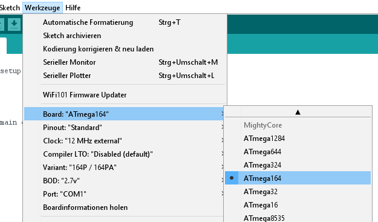
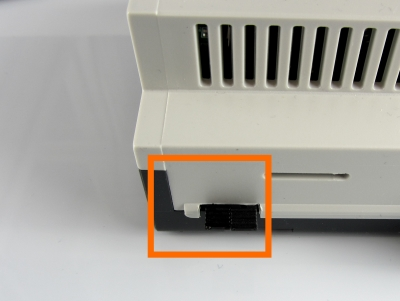

Andino-X2: Firmware
======

**This page provides documentation on the Andino X2 firmware. For a general introduction, refer to [Andino-X2](../../). For more technical documentation on the base board, including setup tutorials and download links for drivers, please refer to [Andino X2: Technical Documentation](../../BaseBoard).**

Table of contents 
   
1. [Setup the Arduino Development Tool](README.md#setup-the-arduino-development-tool)
2. [The Controller](README.md#the-controller)
3. [The initial Firmware - UART communication interface](README.md#the-initial-firmware)
4. [Example in Python](README.md#example-in-python)

## Setup the Arduino Development Tool

To develop a new firmware for the Andino X2 from a PC, please follow this steps:

1. Download the Arduino IDE [here](https://www.arduino.cc/en/main/software)
2. Read the "How to install the Board Defintion" [here](https://github.com/MCUdude/MightyCore#how-to-install)
3. Setup the [Arduino IDE](README.md#setup-the-ide)
4. [Pull the Jumper](README.md#setup-the-jumper)
5. [Plug in the USB Convert and select the COM-Port](README.md#use-the-usb-converter)

### Setup the IDE

The Andino X2 allows to program the Atmel Controller from the Raspberry Pi with avrdude or from a PC via a USB Adapter.  

To program the Atmel Controller with the Arduino IDE just install the Mighty Core Boards.  
Please visit this site [https://github.com/MCUdude/MightyCore](https://github.com/MCUdude/MightyCore#how-to-install) and see "How to install"  
Use this settings inside the Arduino IDE:  
  

Here you will find the initial [Firmware: firmware.ino](https://github.com/andino-systems/Andino-X2/tree/master/src/firmware/firmware.ino) installed on the X2. 

### Setup the Jumper

To use the Controller with the Arduino IDE the jumper must *not* be pluged in.   
   

### Use the USB Converter
This Adapter is available at our shop or from ebay. Leave the Jumper to 5 Volt.
  

## The Controller

The Andino X2 uses the Atmega164PA with 12Mhz clock.

### PIN Definition

    #define PIN_WIRE  		31  // PA7: Dallas temperatur sensor
    #define LED_PIN   		18  // PC2: NeoPixel bus
    
    #define IN_1_PIN   		27	// PA3: digital Input 1
    #define IN_2_PIN   		28	// PA4: digital Input 1
    #define IN_3_PIN   		29	// PA5: digital Input 1
    #define SWITCH_PIN 		30	// PA6: digital Input 1
    
    #define POWER_OUT_PIN   3	// PB3: & Power Out
    #define RELAY_1_PIN 	0	// PB0: Rel 1
    #define RELAY_2_PIN 	1	// PB1: Rel 2
    #define RELAY_3_PIN 	2	// PB2: Rel 3
    
    

## The initial Firmware

The default firmware, witch is inital delivered uses 38400 Baud to communicate to ether the PC or the Raspberry ([the jumpers](README.md#setup-the-jumper))  

This is what the Firmware do:
   
1. Scan the digital Inputs and debounce it
2. Count the (debounced) L-H or H-L Edges on the digital Inputs
3. Switch the Relay on/off or pulse it
4. Controlls the RGB LED
5. Read the temperature sensor
6. Send the Input State and Counter cyclical

### Interface, Commands

All commands or messages are sent and received via  /dev/ttySC1  
All character are ASCII.    
Every command has to be terminated by CR or LF. Message ends with CR and LF.
You can easily test the commands with **minicom**  

    sudo minicom --setup

Set the device to /dev/ttySC1, 38400 Baud, no Hardware Handshake.

### Commands to the Controller
**Command** | Arguments | Action | Example 
--- | --- | --- | ---
RESET | none | Restart the Controller | RESET
INFO | none| Prints the current settings | INFO
HARD | 0=noShield, 1=1DI2DO, 2=3DI | Set the Hardware configuration | 0 - none
POLL | Cycle in ms | Sets the sampling cycle of the digital inputs [in ms] | POLL 1000
EDGE | HL(0) LH(1) | Count on edge HL or LH | EDGE
SEND | Cycle in ms | The counter will send all nnn milliseconds | SEND 5000
DEBO | Number of polls | Sets the debounce count. The signal has to be stable for nn polls | DEBO 100
POWR | state (0 or 1)| Power-Out Relay is switched on or off | POWR 1
REL1 | state (0 or 1)| Relay 1 is switched on or off | REL1 1
REL2 | state (0 or 1)| Relay 2 is switched on or off | REL2 1
REL3 | state (0 or 1)| Relay 3 is switched on or off | REL2 1
RPU1 | pulse in sec | Pulse the Relay 1 for nn seconds | RPU1 2
RPU2 | pulse in sec | Pulse the Relay 2 for nn seconds | RPU2 2
RPU3 | pulse in sec | Pulse the Relay 3 for nn seconds | RPU3 2
PPWR | pulse in sec | Pulse the Power-Out Relay for nn seconds | PPWR 2
TEMP | none | Request the Temperature | TEMP
LED1 | RGB | Set the LED1 R=0..9, G=0..9, B=0..9 | LED1 900 (=max Red)
LED2 | RGB | Set the LED2 R=0..9, G=0..9, B=0..9 | LED3 90 (=max Green)
LED3 | RGB | Set the LED3 R=0..9, G=0..9, B=0..9 | LED4 9 (=max Blue)

### Messages from the Controller

:Message-ID{0000,counter1,counter2,..}{switch-state,state1,state2,..}

The Message starts with a ':'.  
After that follows a Message-ID. This is a modulo HEX Counter from 0..FFFF.    
Then within a '{'  '}' the counter follows.
The first counter is 0. This is the switch in the lid.      
The number of the following counters depends on the extension shields.  
The Counters are HEX encoded and runs from 0 to FFFF (modulo).    
Then again within a '{'  '}' the current state of the inputs follows. 0-off, 1-on.  
The first state is the switch in the lid.    
The number depends on the Hardware.  
The Message ends with a CR / LF [0x0d + 0x0a]  

Example
:0040{0000,0002,0000,000B}{0,0,0,0}  
:0041{0000,0002,0000,000B}{0,0,0,0}  
:0042{0000,0004,0000,000C}{0,0,0,0}  
:0043{0000,0004,0000,000C}{0,0,0,0}  
:0044{0000,0008,0000,000F}{0,0,1,0}  
:0045{0000,0008,0000,000F}{0,0,1,0}  
:0046{0000,000A,0000,0000}{0,0,1,0}  
:0047{0000,000C,0000,0000}{1,0,0,0}  
:0048{0000,0010,0000,0000}{0,0,0,0}  

## Example in Python

    sudo apt-get install python-serial

Create test.py and run with python test.py

    import serial
    import time
    
    port = serial.Serial("/dev/ttySC1", baudrate=38400, timeout=0.5)
    
    port.write("LED1 900\r")
    port.write("REL1 1\r")
    time.sleep(1)
    port.write("REL1 0\r")
    port.write("LED1 0\r")
    
    while True:
         rcv = port.read(50)
         if not rcv:
            continue
         print "\r\nRecv: " + repr(rcv)
    

Author
-----

* 2020 by [AndinoSystems][2]
* [Contact us by email](mailto:info@andino.systems)

[1]:https://andino.systems/andino-x1/
[2]:https://github.com/andino-systems/Andino-X1
