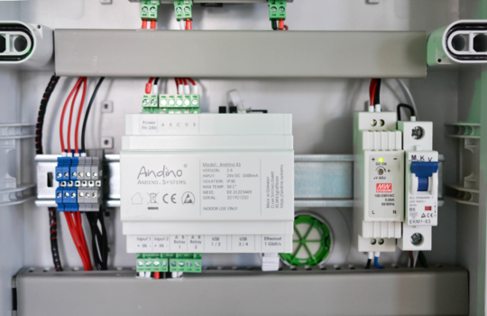
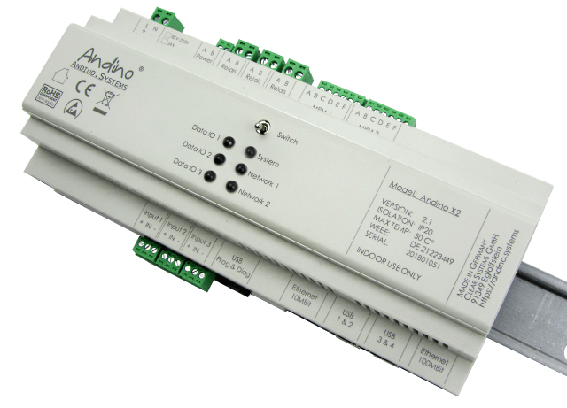
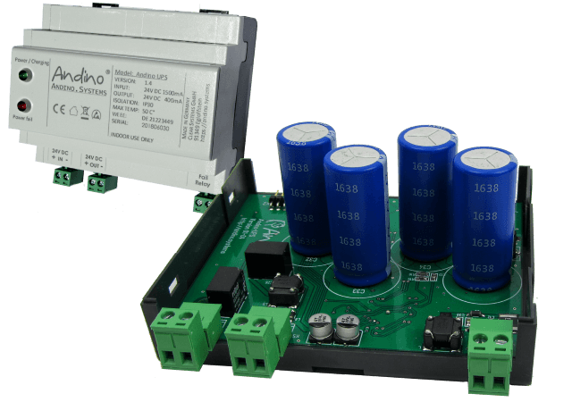

Andino - industrial PC for installation in the control cabinet, based on the Raspberry Pi
======

Andino Systems provides innovative solutions for the usage of Raspberry Pi PCs in industrial environments. Our products, Andino X1, Andino X2 and Andino IO include a robust housing protecting the Pi's sensitive inputs and outputs, as well as, depending on the product and configuration, a real time clock, different BUS technologies, relays and even 2G/4G or LoRaWAN modems. The versatility of the Raspberry Pi also enables data processing specific to the usecase.

## Documentation on our Products

### [Andino X1](./Andino-X1)

**[Andino X1 shop page](http://andino.systems/andino-x1)**

The Andino X1 is a microcontroller board for the Raspberry Pi in a DIN-rail housing for installation in a control cabinet. It is used to adapt digital inputs and outputs for a voltage of 24 V. The X1 has its own microcontroller for precise signal preprocessing and adaptation of signal generators and actuators. It also contains a Raspberry Pi (2/3). The inputs and outputs as well as the power supply of the Pi are optimally protected. Communication between the microcontroller and the Pi takes place via the UART interface.

*The following versions are available:*

- [Andino X1: Breadboard](./Andino-X1/Products/Andino-X1_Breadboard)
- [Andino X1: RS485/RS422](./Andino-X1/Products/Andino-X1_RS485-RS422)
- [Andino X1: dual RS232](./Andino-X1/Products/Andino-X1_Dual-RS232)
- [Andino X1: 7 digital Inputs](./Andino-X1/Products/Andino-X1_7-Inputs)
- [Andino X1: 2DO/1DI](./Andino-X1/Products/Andino-X1_2DO-1DI)
- [Andino X1: CAN Bus](./Andino-X1/Products/Andino-X1_CAN-Bus)
- [Andino X1: LoraWAN](./Andino-X1/Products/Andino-X1_LoraWAN)
- [Andino X1: 2G Modem](./Andino-X1/Products/Andino-X1_2G-Modem)
- [Andino X1: 4G Modem](./Andino-X1/Products/Andino-X1_4G-Modem)

### [Andino X2](./Andino-X2)

**[Andino X2 shop page](http://andino.systems/andino-x2)**

The Andino X2, like the X1, is a microcrontroller board for the Raspberry Pi in a DIN-rail housing for installation in a control cabinet. On top of all the benefits of the X1, it also has more digital inputs and outputs than the X1 and contains an extra Ethernet port and more inputs / relay outputs.

### [Andino IO](./Andino-IO)

**[Andino IO shop page](http://andino.systems/andino-io)**

The Andino IO, like the name suggests, provides a greater amount of inputs and outputs than the X-Series Andino boards. It also includes an OLED-display for easy information access.

*The following versions are available:*

- [Andino IO: LoRaWAN](./Andino-IO/Products/Andino-IO_LoraWAN-Modem)
- [Andino IO: 2G Modem](./Andino-IO/Products/Andino-IO_2G-Modem)
- [Andino IO: 4G/LTE Modem](./Andino-IO/Products/Andino-IO_4G-Modem)

### [Andino UPS](./Andino-UPS)

**[Andino UPS shop page](https://andino.shop/en/c/hardware-shop/andino-usv)**

Andino UPS is an Uninterruptible Power Supply for 24 Volt DC Client Devices.
It stores the Energy in long lasting Supercaps instead of Lead- or Lithium Batteries.
Depending on the environment temperature, the lifetime can reach up to 10 years without any maintenance.

Author
-----

* 2020 by AndinoSystems
* [Contact us by email](mailto:info@andino.systems)
