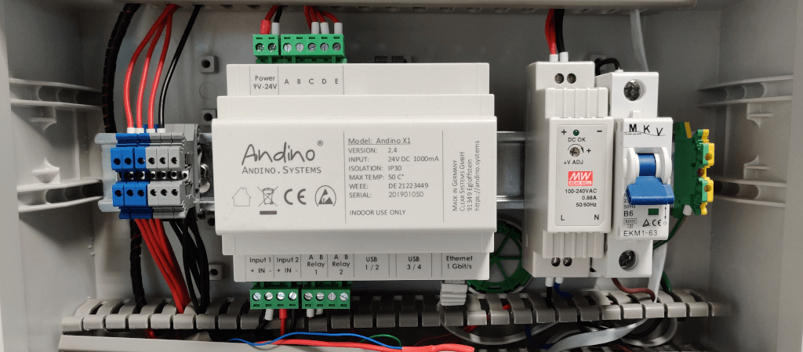
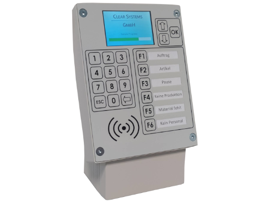

# Andino
**Industrial PCs for installation in the control cabinet, based on the Raspberry Pi**

---

Andino Systems provides innovative solutions for the usage of Raspberry Pi PCs in industrial environments. Our products, Andino X1 and Andino IO include a robust housing protecting the Pi's sensitive inputs and outputs, as well as, depending on the product and configuration, a real time clock, different BUS technologies, relays and even 2G/4G or LoRaWAN modems. The versatility of the Raspberry Pi also enables data processing specific to the usecase.

This repository provides downloads for all the Andino products. For more information on the products, as well as setup documentation, please visit our website **[andino.systems](https://andino.systems/)**. All products can be bought on **[andino.shop](https://andino.shop)**.

For an overview of all our custom Andino software for usage in conjunction with Andino and RaspberryPi hardware, visit our **[Software & Drivers page](https://andino.systems/programming)**.

## Andino X1

The Andino X1 is a microcontroller board for the Raspberry Pi in a DIN-rail housing for installation in a control cabinet. It is used to adapt digital inputs and outputs for a voltage of 24 V. The X1 has its own microcontroller for precise signal preprocessing and adaptation of signal generators and actuators. It also contains a Raspberry Pi (2/3). The inputs and outputs as well as the power supply of the Pi are optimally protected. Communication between the microcontroller and the Pi takes place via the UART interface.

* **[Andino X1 shop page](https://andino.shop/en/c/hardware-shop/andino-x1)**
* **[Andino X1 documentation](https://andino.systems/andino-x1/andino-x1-overview)**

## Andino IO

The Andino IO, like the name suggests, provides a greater amount of inputs and outputs than the Andino X1. It also includes an OLED-display for easy information access.

* **[Andino IO shop page](https://andino.shop/en/c/hardware-shop/andino-io)**
* **[Andino IO documentation](https://andino.systems/andino-io/andino-io-overview)**

## Andino UPS

Andino UPS is an Uninterruptible Power Supply for 24 Volt DC Client Devices.
It stores the Energy in long lasting Supercaps instead of Lead- or Lithium Batteries.
Depending on the environment temperature, the lifetime can reach up to 10 years without any maintenance.

* **[Andino UPS shop page](https://andino.shop/en/c/hardware-shop/andino-usv)**
* **[Andino UPS documentation](https://andino.systems/andino-ups/andino-ups-overview)**

## Andino Terminal

The Andino Terminal is a versatile terminal powered by the Raspberry Pi 3B+ or Pi 4. Its based on the Andino IO, with keyboard, programmable function keys, touch-screen display, RFID capabilities and a large variety of IO options. The large variety of connectivity options allows for operation of the terminal completely independent of other devices. It can be used as a base server for access control, controlling machines in a production envioronment, reading sensors, controlling relays and much more.

* **[Andino Terminal shop page](https://andino.shop/en/c/hardware-shop/andino-terminal)**
* **[Andino Terminal documentation](https://andino.systems/)**

---

### Author

* 2022 by Andino Systems
* [Contact us by email](mailto:info@andino.systems)
